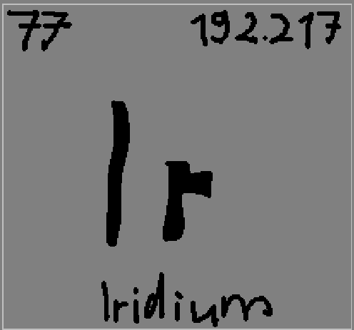

<div align="center">
  
</div>

# Iridium

A lightweight, annotation-driven HTTP micro-framework for Java 25. Zero external server dependencies — Inspired by Spring Boot but purposefully minimal.

## Quick Start

### 1. Create a controller

```java
import de.yyuh.iridium.boot.controller.type.RestController;
import de.yyuh.iridium.boot.request.RequestContext;
import de.yyuh.iridium.boot.request.type.GET;
import de.yyuh.iridium.boot.request.type.POST;
import de.yyuh.iridium.boot.response.Response;

@RestController
public final class HelloController {

    @GET("/hello")
    public Response hello(final RequestContext ctx) {
        final var name = ctx.queryParam("name").orElse("world");
        return Response.ok().text("Hello, " + name + "!");
    }

    @POST("/echo")
    public Response echo(final RequestContext ctx) {
        return ctx.body()
            .map(Response::ok)
            .unwrapOrElse(err -> Response.badRequest(err.getMessage()));
    }
}
```

### 2. Bootstrap

```java
import de.yyuh.iridium.boot.Iridium;
import de.yyuh.iridium.boot.IridiumBootstrap;

@IridiumBootstrap(port = 8080, host = "0.0.0.0")
public final class Main {
    public static void main(final String[] args) {
        Iridium.run(Main.class, args);
    }
}
```

### 3. Run

```bash
curl http://localhost:8080/hello?name=iridium
# → Hello, iridium!
```

## Request Handling

Each controller method takes a `RequestContext` and returns a `Response`.

```java
@GET("/users/{id}")
public Response getUser(final RequestContext ctx) {
    final var token = ctx.requestHeader("Authorization");
    // → Optional<String>

    final var params = ctx.queryParams();
    // → Map<String, List<String>>

    final var body = ctx.body();
    // → Result<String, IOException>

    return Response.ok().json("{\"id\": 1}");
}
```

## Response Builder

```java
Response.ok()                          // 200, empty body
Response.ok("hello")                   // 200, text body
Response.created(json)                 // 201
Response.noContent()                   // 204
Response.badRequest("invalid")         // 400
Response.notFound("missing")           // 404
Response.status(418)                   // custom status

Response.ok()
    .json(body)                        // Content-Type: application/json
    .header("X-Request-Id", "abc123") // custom header
```

Responses are immutable records — headers accumulate via copy-on-write.

## Available Annotations

| Annotation | HTTP Method | Target |
|-----------|-------------|--------|
| `@GET("/path")` | GET | Method |
| `@POST("/path")` | POST | Method |
| `@PUT("/path")` | PUT | Method |
| `@PATCH("/path")` | PATCH | Method |
| `@DELETE("/path")` | DELETE | Method |
| `@HEAD("/path")` | HEAD | Method |
| `@OPTIONS("/path")` | OPTIONS | Method |
| `@RestController` | — | Class |
| `@IridiumBootstrap` | — | Class (main) |

## Build

Requires Java 25.

```bash
./gradlew build
```
